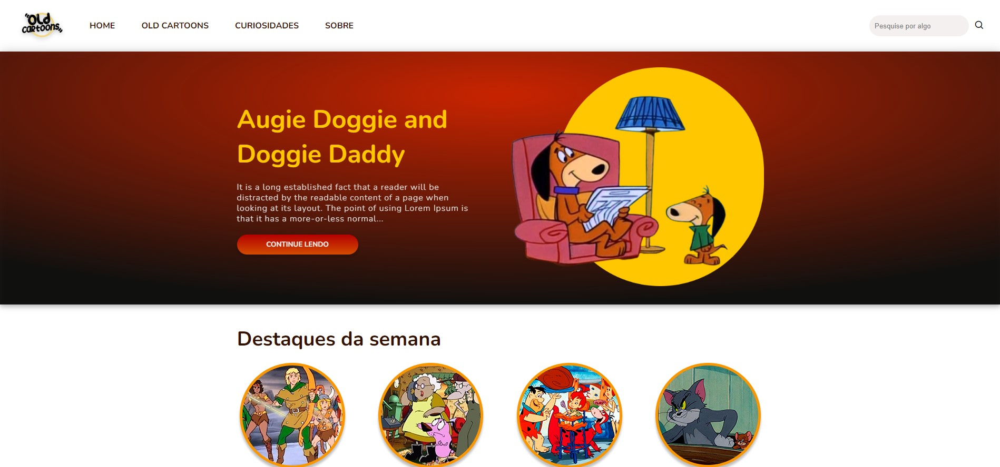

# Old Cartoons

## Descrição

O site old cartoons tem como temática "desenhos antigos" e foi criado com a intenção de reforçar estudos referente a html e css.

## Ajustes e melhorias

O projeto Já foi finalizado, mas ao decorrer do tempo se precisar de alguma melhoria tanto em layout quando em estrutura do código, estaremos ajustando.

- [x] Criar página Home
- [x] Criar página Old Cartoons
- [x] Criar página Curiosidades
- [x] Criar página sobre

## 🤝 Colaboradores

### Feitos: 

A Jaqueline foi responsável pela parte do layout criado no figma e também pela parte estrutural e estilização do projeto.

O Eric foi responsável pela parte estrutural e estilização do projeto.

### Imagem colaborador

<table>
  <tr>
    <td align="center">
      <a href="https://github.com/jaquelinelima2">
         
        
          <b>Jaqueline Lima</b>
        
      </a>
    </td>
    <td align="center">
      <a href="https://github.com/Ericodesenvolvedor">
         
        
          <b>Eric Oliveira</b>
        
      </a>
    </td>
  </tr>
</table>

## 📝 Licença

- Não há licenças disponiveis neste projeto

[⬆ Voltar ao topo](#Old-Cartoons) 

<!-- # Site Old Cartoons 

Repositório criado durante estudo

Criação de Site fictício sobre desenhos antigos.

 
## Aprendizados

Prática de HTML E CSS

## 🛠 Habilidades

HTML
CSS
Figma 

## Apêndice

Banner e logo criados e improvisados por mim  para este projeto.

Layout criado por mim no Figma. -->
